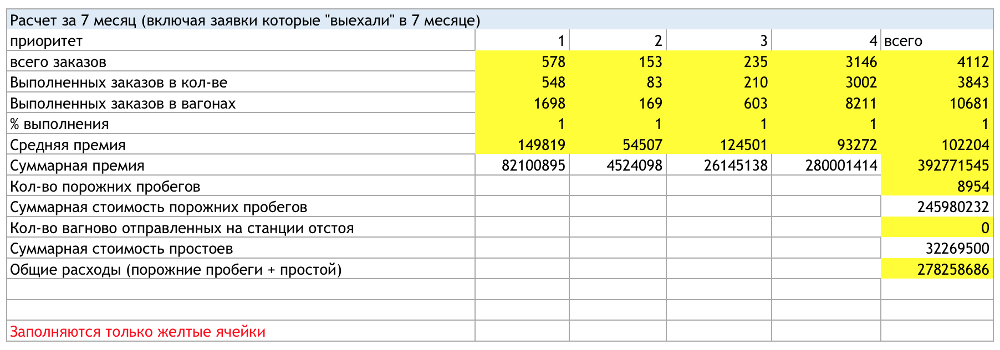

# train-of-thought

[Ramaximization](https://ramaximization.ru) hackathon solution made by team "Свидетели ретротранспозонов" (task 1 - Wagon logistics)

Our best solution have produced the following results:



The full results, which were produced by `notebooks/basic_template.ipynb` script, can be found at `results` folder. `KPI.xlsx` file has LPI sheet filled by hand (screenshot shows its contents), the orders and empty moves can be found at `orders.csv` and `empty_moves.csv`.

Our presentation can be found at Google Docs [here](https://drive.google.com/file/d/103TZjia1Uit7pbxe27JLvZB2xzgNn-FO/view?usp=sharing).

## Project structure

- `data` contains prepared contest's dataset. xlsx are saved "as is", description is saved to txt file (to view it at github). It also contains prepared preprocessed tables extracted from `data/input_wagon.xlsx`.
- `notebooks` contains .ipynb files - exploratorials and experiments with data (and maybe some plots)
- `utils` contains method used in notebooks (common code to build graphs, work with data, etc.).
- `results` contains required tables with metrics - KPI, emptyMoves and orders.


## Installation
### Dependencies installation

Currently the code is written in python 3.7, some dependencies are provided at `requirements.txt` file. To install them, run
```
pip install -r requirements.txt
```
To run (or re-run) .ipynb-files, which are located at notebooks directory, you'll need to install jupyter notebook.

## HOWTO run code

During the hackathon we've used http://deepnote.com/ to edit data collaboratively. If you want to run provided .ipynb files locally, install [jupyter notebook](https://jupyter.org/install) and use it to open them.

To do it, run 
```
jupyter notebook
```
from the project's root directory. After that open file `notebooks/basic_template.ipynb` and run it.

We've also converted our best solution to utility script `process_orders.py`. If you'll run:
```
time python process_orders.py --datadir data
```
the script will process separate tables saved to `data` directory and save results to repository's root folder.
The end of console output for this run will look similar to this:

```
Bad orders - {1: 30, 4: 144, 3: 25, 2: 70}
Total orders - {4: 3146, 1: 578, 3: 235, 2: 153}
Profit - 392870345
Stale stop - 32272250.0
Stale move - 245682786
Profit per cat - {4: 280100214, 3: 26145138, 1: 82100895, 2: 4524098}
python basic_template.py  261,41s user 1,92s system 96% cpu 4:32,75 total
```

Note, that it expects to find several `.csv.gz` files, which were produced from  `input_wagon.xlsx` sheets.